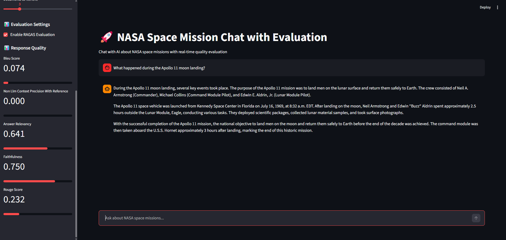
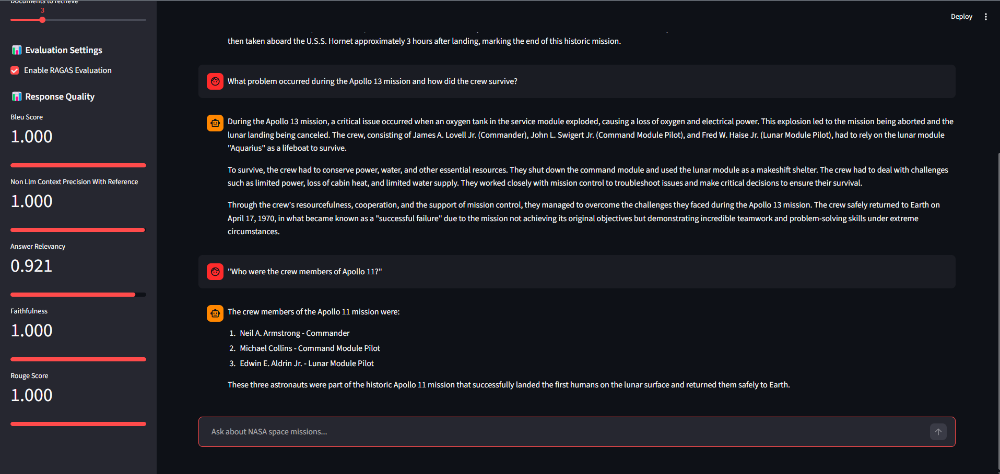
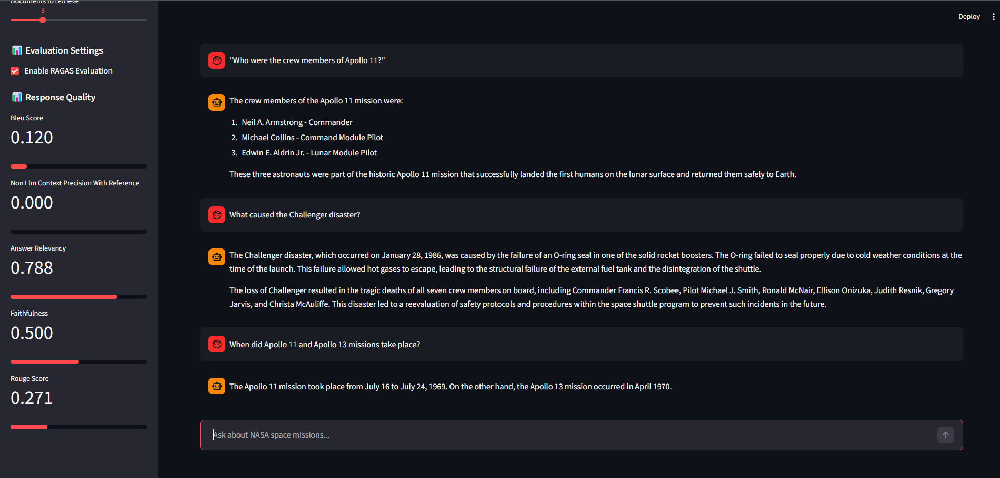

# NASA RAG Chat Evaluation Report

I have created the test_questions.json file as ground truth for evaluation using LLMs help.

## Real Application Testing

### Question 1: "What happened during the Apollo 11 moon landing?"

### Question 2: "What problem occurred during the Apollo 13 mission and how did the crew survive?"

### Question 3: ""Who were the crew members of Apollo 11?"

### Question 4: "What caused the Challenger disaster?"

### Question 5: "When did Apollo 11 and Apollo 13 missions take place?"

