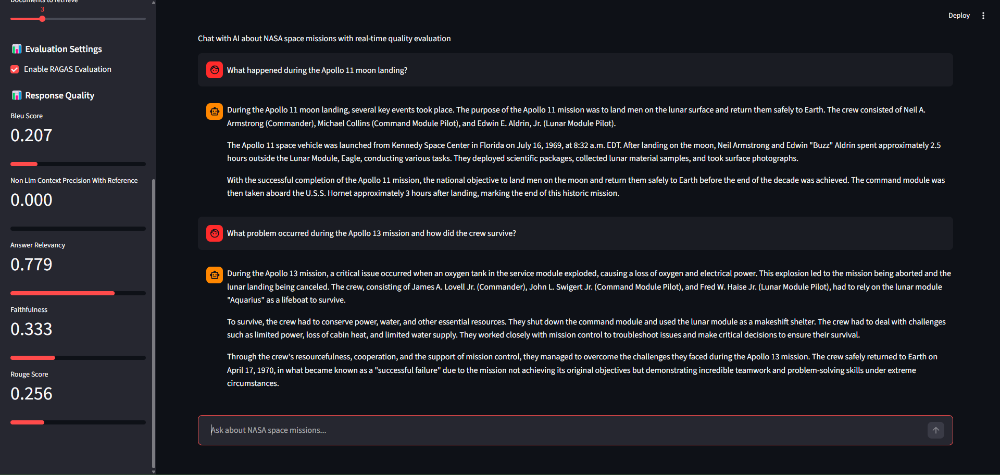
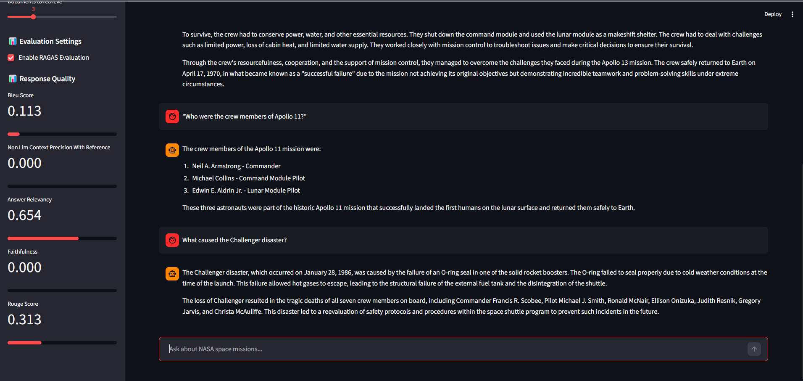

# NASA RAG Chat Evaluation Report

I have created the test_questions.json file as ground truth for evaluation using LLMs help.

## Environment key setup

Make sure the .env file contains property "OPENAI_API_KEY" with your OpenAI API key.

## Required Libraries

Make sure to install the required libraries using 

``` 
pip install -r requirements.txt
```

## DB Embedding folder

The `embedding_pipeline.py` script is used to create the vector database for the RAG system. The generated vector database is stored in the `chroma_db_openai` folder. This folder contains the necessary files for the RAG system to retrieve relevant information during the chat interactions.

## Real Application Testing

### Question 1: "What happened during the Apollo 11 moon landing?"


### Question 2: "What problem occurred during the Apollo 13 mission and how did the crew survive?"



### Question 3: ""Who were the crew members of Apollo 11?"


### Question 4: "What caused the Challenger disaster?"



### Question 5: "When did Apollo 11 and Apollo 13 missions take place?"

