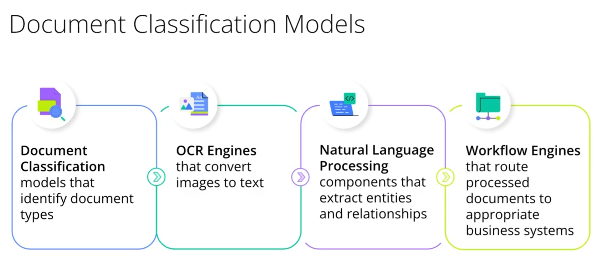
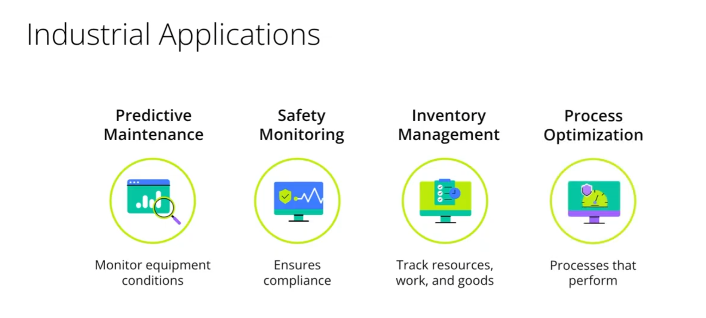
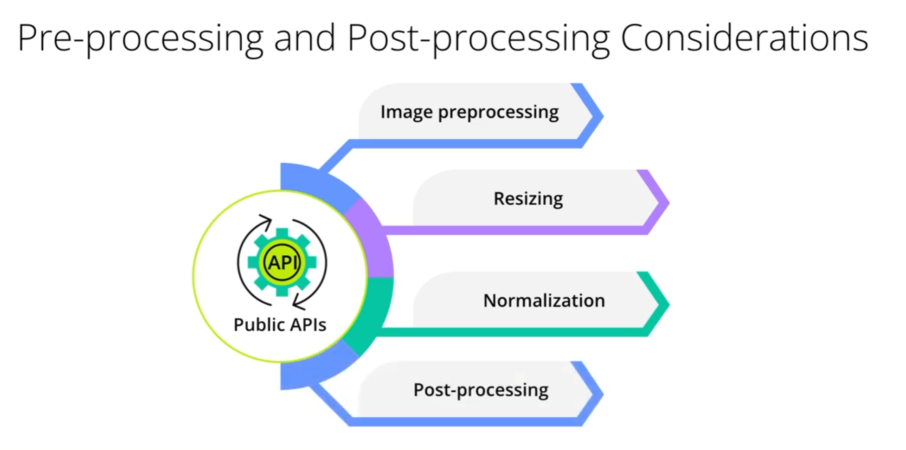
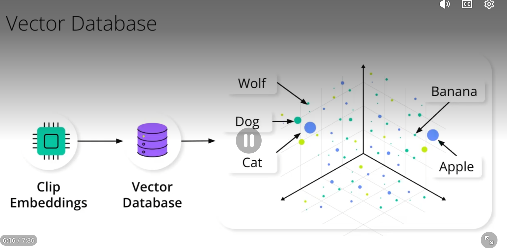
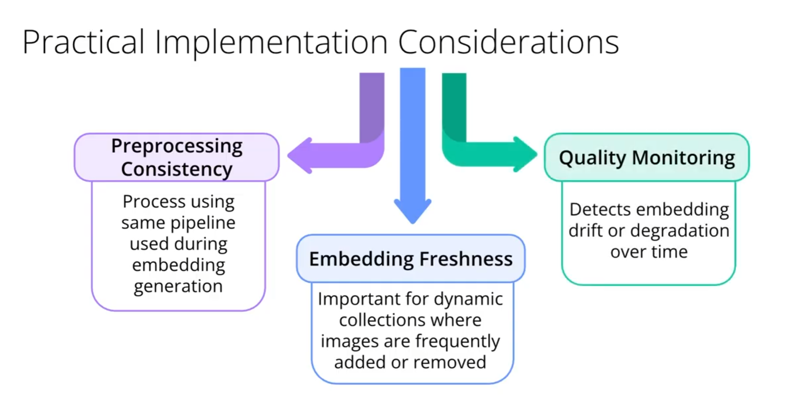
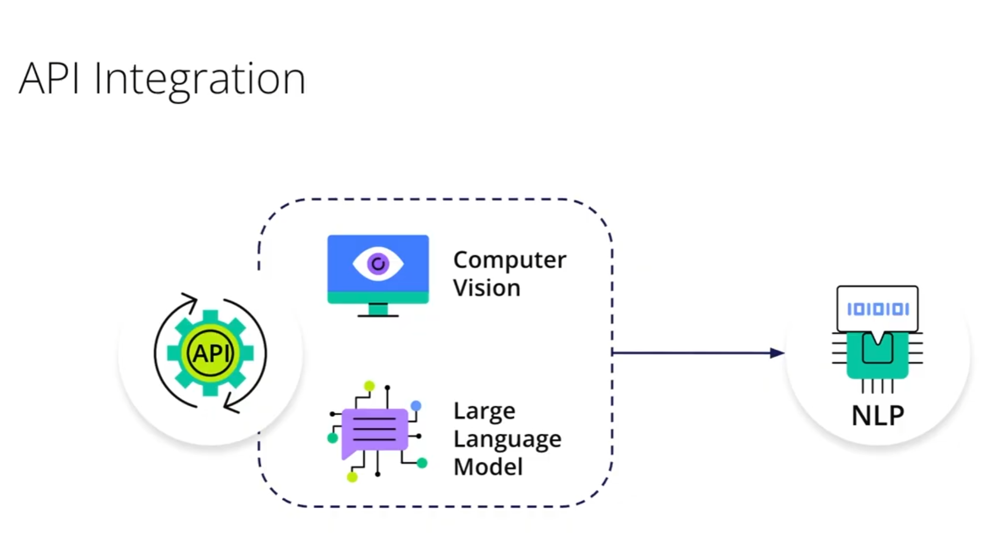
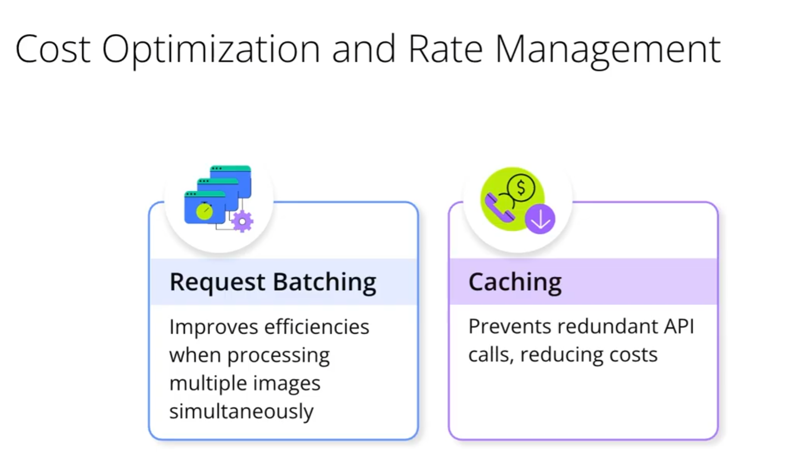
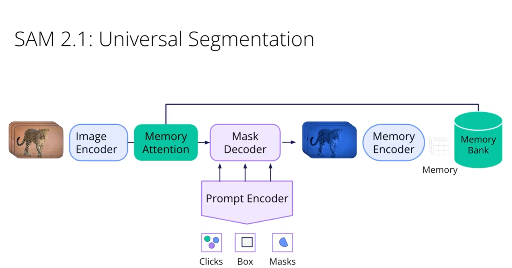
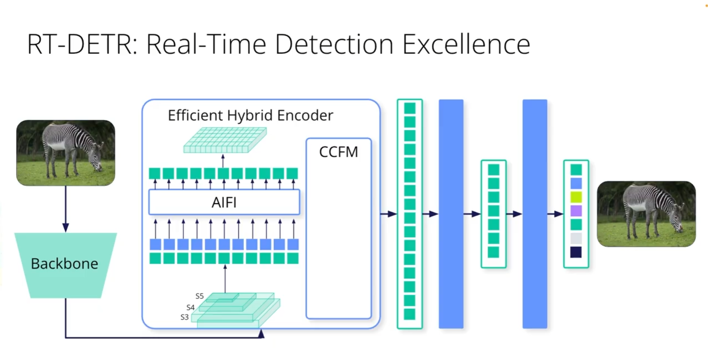
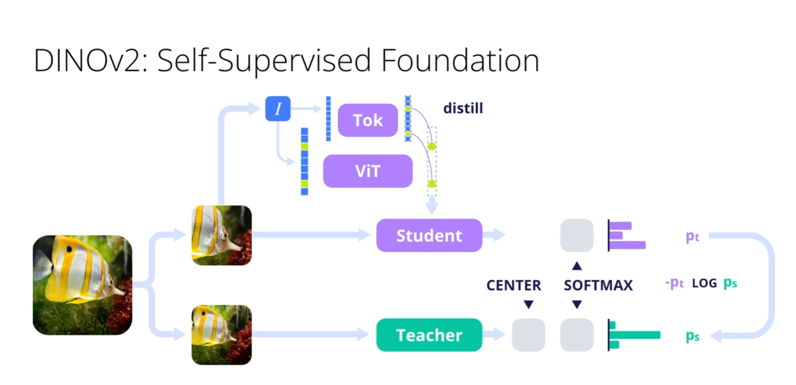

- Pydantic and its advantage where we enforce the return type shape of the function. This is a great way to ensure that the output of our functions is consistent and can be easily used by other parts of our code.
- Using Enterprise vision in quality check and applying a full automated alerts system by capturing then analyzing live. Automated inspections!
- Document processing automation / workflow. OCR, with templates, extract data. .
  - We can start with standard documents like invoices then move to more complex documents .
- For production fields are predictive maintenance, inventory management, and quality control and process optimization. 
- Object detection vs image classification. Object detection is more complex but provides more information about the location of objects in an image, while image classification simply categorizes the entire image.
- There is also semantic segmentation, which is a more advanced technique that assigns a class label to each pixel in an image, allowing for more detailed analysis of the image content. This can be used in production for tasks such as autonomous driving, where understanding the precise location of objects in the environment is crucial.
- For image application PNG is better than JPEG because it supports transparency and lossless compression, which can be important for certain applications such as web design and graphic design. However, JPEG is better for photographs and images with many colors because it uses lossy compression that can reduce file size without significantly affecting image quality.
- 
- Hugging ace Transformer, dataset pipline for Image operations. Also open cv with Pillow for image processing.
- resize vs thumbnail. Resize changes the size of the image to the specified dimensions, while thumbnail maintains the aspect ratio of the image and resizes it to fit within the specified dimensions. Thumbnail is often used for creating smaller versions of images for display purposes, while resize is used when you need to change the size of an image for a specific use case, such as fitting it into a certain layout or reducing its file size.
- Embedding in computer vision is a way to represent images as vectors in a high-dimensional space. This allows us to compare and analyze images based on their content, rather than just their pixel values. Embeddings can be used for tasks such as image retrieval, where we want to find similar images in a database, or for image classification, where we want to categorize images based on their content. 
- CLIP is a powerful model that can understand both images and text, allowing it to perform tasks such as image captioning and zero-shot image classification. It works by learning a shared representation of images and text, which allows it to understand the relationships between them. This makes it a valuable tool for a wide range of applications in computer vision and natural language processing.
- cos similarity is a measure of similarity between two vectors in a high-dimensional space. It is calculated as the cosine of the angle between the two vectors, which ranges from -1 to 1. A value of 1 indicates that the vectors are identical, while a value of -1 indicates that they are completely opposite. Cosine similarity is often used in tasks such as image retrieval and natural language processing to compare the similarity of different data points based on their vector representations.
- 
- 
- CLIP allow us to build system like search engine for images.
- 
- API integration makes it easy to connect different services and tools together, most of todays tools has 3 parameters: temprature, top_p, and max_tokens. Temperature controls the randomness of the output, with higher values producing more random output and lower values producing more deterministic output. Top_p controls the diversity of the output by limiting the number of possible tokens that can be generated at each step, while max_tokens limits the total number of tokens that can be generated in a single response. By adjusting these parameters, we can fine-tune the behavior of our API calls to better suit our specific use case and achieve the desired results.
- Structured output is important, the output schema contains responses and datatypes. Constraint response by set of categories, for example: "response": {"type": "object", "properties": {"category": {"type": "string", "enum": ["cat", "dog", "bird"]}}}}. This allows us to ensure that the output of our functions is consistent and can be easily used by other parts of our code, while also providing clear guidelines for how the output should be structured and what types of data it should contain.
- Cost optimization is crucial when working with APIs, especially when dealing with large volumes of data or complex models. By optimizing our API calls and using techniques such as batching and caching, we can reduce the number of API calls we need to make and minimize the cost of using these services. Additionally, we can also consider using more cost-effective alternatives or implementing our own models if the cost of using third-party APIs becomes prohibitive.
- 
- Vision transformer architecture is a powerful model that can be used for a wide range of computer vision tasks, including image classification, object detection, and image segmentation. It works by using self-attention mechanisms to capture long-range dependencies in the input data, allowing it to learn complex patterns and relationships between different parts of an image. This makes it a valuable tool for tasks such as image recognition and analysis, where understanding the relationships between different objects and features in an image is crucial for achieving accurate results.
- CLS token is a special token used in transformer models to represent the entire input sequence. It is typically added at the beginning of the input sequence and is used to capture the overall meaning or context of the input data. In computer vision tasks, the CLS token can be used to represent the entire image, allowing the model to learn a global representation of the image that can be used for tasks such as image classification or retrieval. By using the CLS token, we can ensure that our model is able to capture the overall meaning and context of the input data, which can lead to improved performance on a wide range of computer vision tasks.
- 
- 
- 
- SMA, RT-DETR and DINOv2 are all powerful models for object detection and image analysis. SMA is a lightweight model that can be used for real-time applications, while RT-DETR is a more complex model that can achieve higher accuracy but may require more computational resources. DINOv2 is a state-of-the-art model that can achieve high accuracy on a wide range of computer vision tasks, including object detection and image segmentation. By choosing the right model for our specific use case, we can ensure that we are able to achieve the best possible results while also optimizing for performance and resource usage.
- Difusion models are a type of generative model that can be used for tasks such as image generation and style transfer. They work by modeling the diffusion process of data, allowing them to generate new data points that are similar to the training data. Diffusion models can be used in computer vision tasks to generate new images or to transfer the style of one image to another, making them a valuable tool for creative applications such as art and design.
- Multimodal with CLIP are powerful models that can understand both images and text, allowing them to perform tasks such as image captioning and zero-shot image classification. By combining the strengths of both modalities, we can create more powerful and flexible models that can be used for a wide range of applications in computer vision and natural language processing. For example, we can use CLIP to generate captions for images, or to classify images based on their content without needing to train a separate model for each task. This makes it a valuable tool for building more intelligent and versatile systems that can understand and interact with the world in a more human-like way.